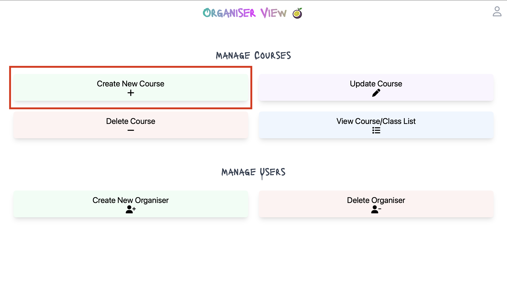
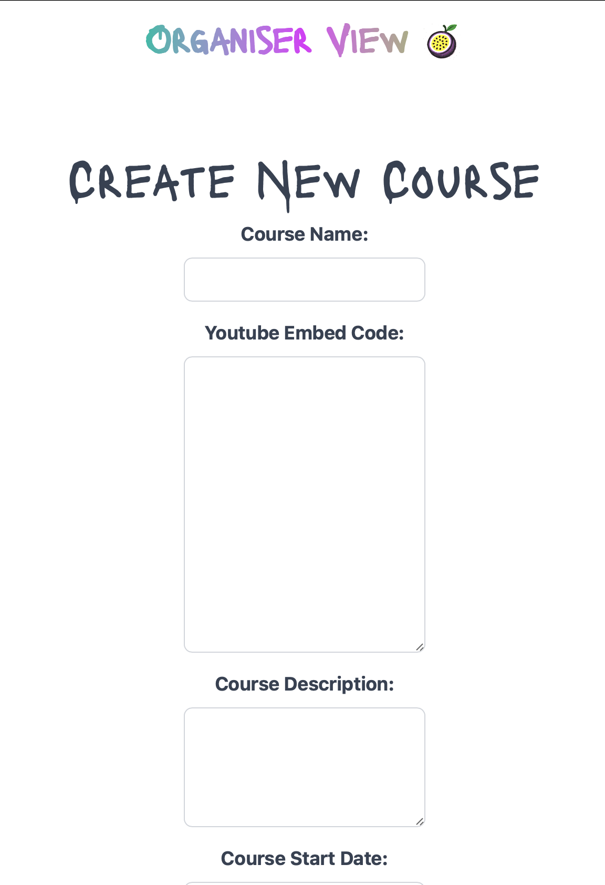
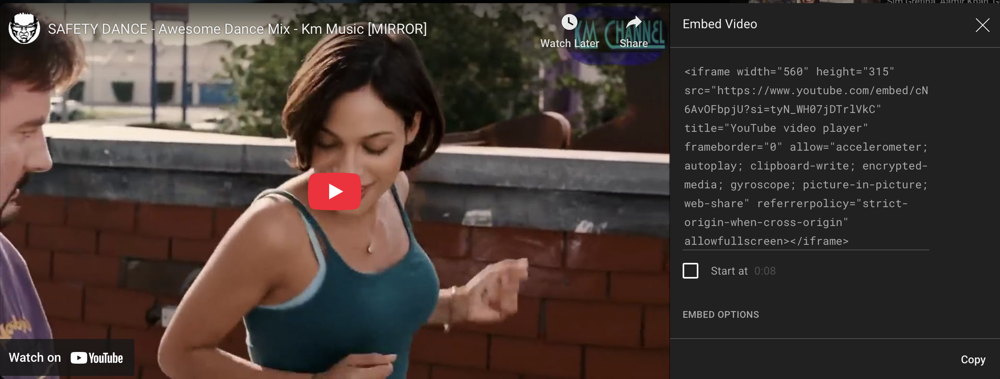

# How to Create Courses

[Back Home](../README.md#organiser-view-docs)

Organisers can create courses in the Organiser View.  This is a step by step guide on how to create a course.

## Before you start

Make sure that:
- You have logged in to the Organiser View
  - [Live Implementation Login Page]("https://passionfruitstudios.azurewebsites.net/login")
  - [Local Implementation Login Page]("http://localhost:3000/login")

## How to Create a Course

An Organiser can create a course in the Organiser View.
1. Click on the **Create New Course** button on the Organiser View.

2. Fill in details on the **Create Course** page.

Expected data as follows:

| Field                               | Description                                                                                | Example                            |
|-------------------------------------|--------------------------------------------------------------------------------------------|------------------------------------|
| Course Name                         | The name of the course                                                                     | "Learn Safety Dance"               |
| Youtube Embeded Link                | The embeded code from youtube                                                              | See Screenshot below               |
| Course Description                  | A short description of the course                                                          | This is a course on Dancing Safely |
| Course Start Date & Course End Date | The date the course starts. This is free text                                              | 2023-10-01                         |
| Course Duration                     | The duration of the course.  This is free text                                             | 2 weeks                            |
| Course Time                         | The time the course/classes start.  This is free text                                      | 10:00 AM                           |
| Course Schedule                     | The schedule of the course.  This is free text                                             | Monday, Wednesday, Friday          |
| Course Location                     | The location of the course.  This is free text                                             | Studio A                           |
| Course Fee                          | The fee for the course.  This is free text that inserts the '£' character at the beginning | 100                                |
| Instructor                          | The name of the instructor.  This is free text                                             | John Doe                           |
| Instructor Bio                      | A short bio of the instructor.  This is free text                                          | John Doe is a professional dancer  |
| Beginner/Intermediate/Advanced      | The level of the course.  This is a checkbox.  Please only select 1                        | Check box                          |

Youtube Embeded Link

3. Click on the **Create Course** button to create the course.
